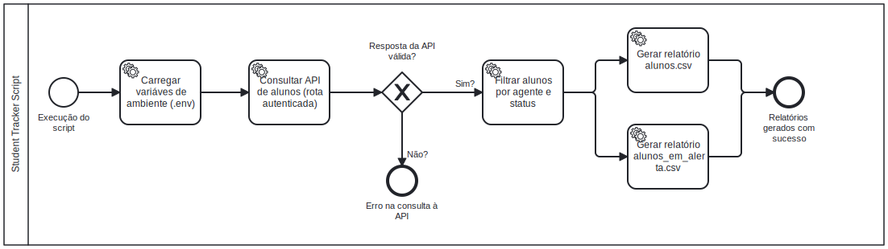

# 🎯 Student Tracker — Automação de Acompanhamento de Alunos via API

Script em **Python** desenvolvido para **automatizar o acompanhamento de alunos vinculados a um agente de sucesso**, consultando uma API interna e gerando **relatórios automáticos em CSV**.

O projeto serve como base para automações de **monitoramento**, **análise de engajamento** e futuras integrações com **dashboards, alertas e pipelines de dados**.

---

## 🚀 Funcionalidades

* Consulta dados de alunos via **API autenticada**
* Filtragem automática de:

  * Alunos **ativos** vinculados a um agente específico
  * Alunos em **atenção** ou **recuperação**
* Geração automática de relatórios em **CSV**:

  * `alunos.csv` → todos os alunos ativos
  * `alunos_em_alerta.csv` → alunos que exigem acompanhamento mais próximo
* Estrutura pensada para **expansão futura** (planilhas, e-mails, dashboards, automações contínuas)

---

## 🧠 Tecnologias Utilizadas

* **Python 3.10+**
* **Requests** – Integração com API REST
* **python-dotenv** – Gerenciamento seguro de variáveis de ambiente
* **CSV (nativo)** – Exportação de relatórios estruturados

---

## 🔄 Fluxo do Script



O fluxo acima representa a execução do script de forma **linear e automatizada**, priorizando clareza e simplicidade operacional:

1. O script é iniciado manualmente
2. As variáveis de ambiente são carregadas a partir do arquivo `.env`
3. A API interna é consultada utilizando autenticação via **API Key**
4. A resposta da API é validada
5. Os alunos são filtrados por:

   * Agente responsável
   * Status acadêmico
6. Os relatórios em **CSV** são gerados automaticamente
7. O processo é finalizado com feedback no terminal

---

## ⚙️ Configuração

### 1️⃣ Clone o repositório

```bash
git clone https://github.com/seuusuario/student-tracker.git
cd student-tracker
```

---

### 2️⃣ Crie o arquivo `.env`

Crie um arquivo `.env` na raiz do projeto com as seguintes variáveis:

```env
URL_API= # URL da API interna
API_KEY= # Chave de autenticação fornecida
AGENTE_EMAIL= # E-mail do agente de sucesso
```

---

### 3️⃣ Instale as dependências

```bash
pip install -r requirements.txt
```

---

### 4️⃣ Execute o script

```bash
python main.py
```

---

## 🖥️ Exemplo de Saída no Terminal

```bash
Buscando dados da API...

Total de alunos ativos vinculados: 12

Lista completa de alunos:
- Ana Paula Oliveira | PDITA123 | Status: Atencao
- Bruno Henrique Santos | PDITA456 | Status: Ativo
- Carla Menezes Rocha | PDITA789 | Status: EmRecuperacao
...

Alunos em atenção ou recuperação:
- Ana Paula Oliveira | PDITA123 | Status: Atencao
- Carla Menezes Rocha | PDITA789 | Status: EmRecuperacao

Total em alerta: 2
```

---

## 📂 Arquivos Gerados Automaticamente

* `alunos.csv`
* `alunos_em_alerta.csv`

---

## 📝 Notas de Desenvolvimento

Este projeto foi desenvolvido com foco em **automação simples, confiável e reutilizável**, priorizando:

* Clareza de fluxo
* Facilidade de execução
* Baixa dependência de infraestrutura externa

A arquitetura permite evolução natural para:

* Envio automático de relatórios por e-mail
* Integração com Google Sheets
* Dashboards analíticos
* Execução agendada em servidores ou containers

---

## 🔮 Próximos Passos

* 🔔 Envio automático dos relatórios por e-mail
* 📈 Integração com Google Sheets e dashboards dinâmicos
* 🧭 Análises preditivas de risco de evasão
* 💬 Notificações automáticas para alunos em atenção
* ☁️ Execução agendada em servidor (automação contínua)

---

## 🧑‍💻 Autor

Desenvolvido por **Gustavo Felippe Barbosa** 💡
📬 Conecte-se comigo no [LinkedIn](https://www.linkedin.com/in/gustavofelippebarbosa/)
